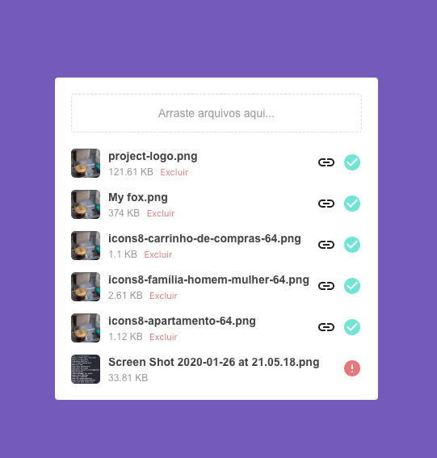

# Upload image proto (Frontend)
:camera: Sample upload image interface built with React and AWS-S3

This application is using heroku buildpacks:
* create-react-app: mars/create-react-app

### [Live Demo](https://rlk-upload-project-frontend.herokuapp.com/)



### Start API
[Clone the project](https://github.com/Relirk/upload-project-backend) or test
[the live API](https://rlk-upload-project-backend.herokuapp.com/)

### Running Locally
```sh
# Install dependencies
yarn install

# Start the app on a new window
yarn start
```

